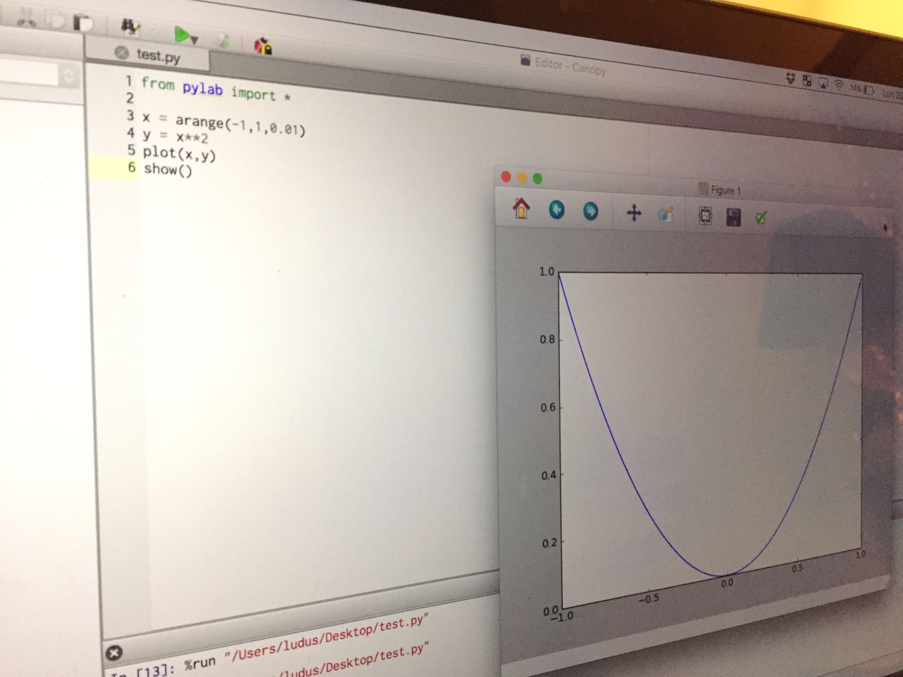
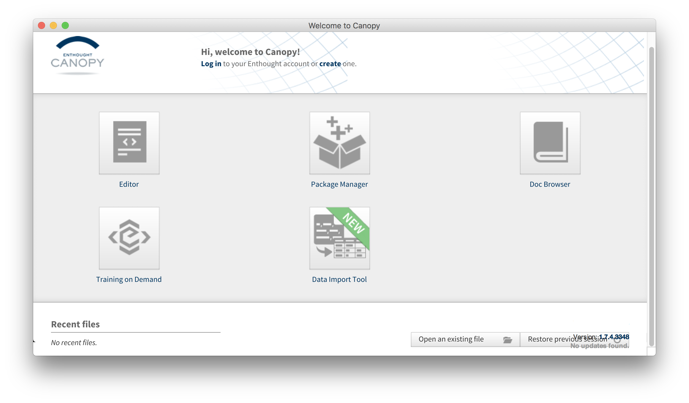
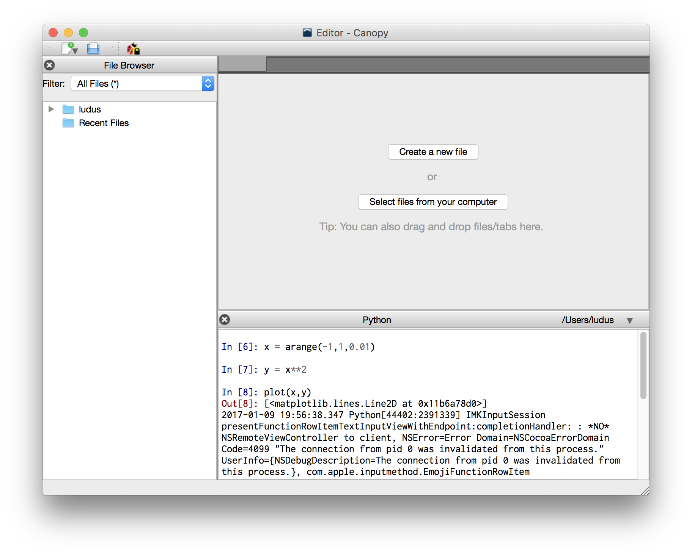
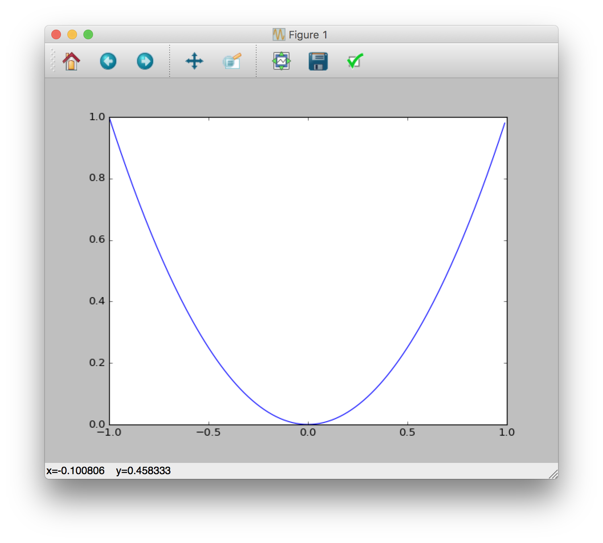

Da ingegnere meccatronico e informatico, sono abituato ad utilizzare Matlab, uno dei tool più importanti disponibili in ambito ingegneristico e scientifico. Durante la mia carriera universitaria (sia da studente che da dottorando) ho avuto modo di utilizzare Matlab in tantissimi corsi, da analisi dei segnali a robotica. Mi sono sempre interessato a cercare una valida alternativa OpenSource a questo programma, e ho sempre creduto che tutta la suite **matplotlib** fosse un buon compromesso... Questo finchè non mi sono imbattuto in **Canopy**.

**Canopy** non è un progetto completamente Open, anche se è per la maggior parte composto da moduli Open Source ed è sviluppato dalla società _Enthought, Inc_. Potete scaricare una vesione gratuita molto completa dal bottone sotto, che essenzialmente include una serie di pacchetti Python Open per l'analisi dei dati, un'interfaccia interattiva di comando basata su iPython e pyLab, e un IDE di lavoro che sarà familiarissimo agli utilizzatori di MatLab.

<a type="button" class="btn btn-info bnt-lg" href="https://store.enthought.com/downloads/#default"> Scarica Canopy</a>

###Posso fare tutto quello che faccio con matlab con questo tool?

Ovviamente no, non credo ad esempio (o non ne conosco) che esistano alternative Python a Simulink & Co., però ho fatto un velocissimo test e molte delle cose che ho fatto abitualmente nei corsi con Matlab posso farle con Canopy!

## Esempio di utlizzo

Una volta installata l'applicazione (si installa molto facilmente), apriamo il programma e vedremo la seguente schermata



Selezioniamo il pulsante **Editor** e accederemo ad un'interfaccia molto simile a quella di matlab.



Dalla linea di comando interattiva possiamo scrivere del codice Python con interfaccia pyLab. Ecco un brevissimo esempio per plottare a video una parabola.

Generiamo un vettore $x$ contenente numeri da $-1$ a $1$ con passo $0.01$

```
x = arange(-1,1,0.01)
```

Generiamo i valori $y = x^2$ corrispondenti

```
y = x**2
```

Plottiamo i vettori $x$ e $y$

```
plot(x,y)
```

Otterremo il seguente grafico



##Considerazioni

Ho scoperto da poco questo interessantissimo tool, ho intenzione di utilizzarlo nel progetto di [fisica che sto realizzando per la mia scuola](http://www.ludusrusso.cc/posts/2017-01-04-arduino-python-lab-fisica-1)! Fatemi sapere se voi lo usate e se avete consigli!
