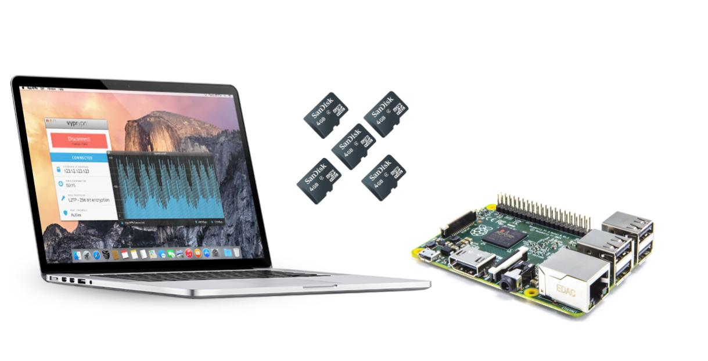
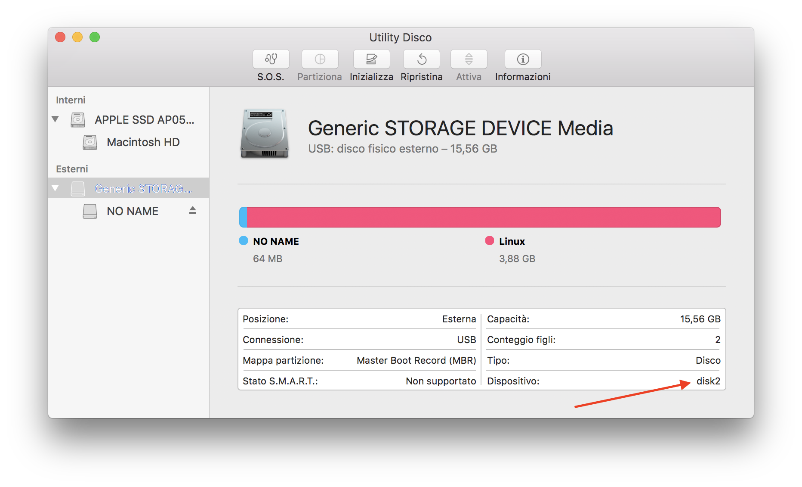

Ultimamente noto che su internet c'è molta confusione sui tools per effetturare backup e ripristino della SD del Raspberry Pi usando un Mac (quindi con MacOS). Questo tutorial lo scrivo principalmente come reminder per me, dopo aver sperimentato un po' di soluzioni in rete e visto quella che funziona meglio.



##Passaggi generali

Sia che vogliamo clonare l'SD su mac, sia che vogliamo scrivere su SD un'immagine precedentemente backappata o scaricata dal web, è importante prima di tutto trovare il file rappresentante l'SD sul mac. Questo file ha un nome nella forma `diskN`, dove `N` è un numero intero (ad esempio `disk2` o `disk3`).

Per scoprirlo, una volta inserita l'SD nel Mac, apriamo il programma **Utility Disco** e selezioniamo, sotto la voce `Esterni`, la nostra SD. Se non avete inserito altri dispositivi esterni di memoria (come chiavette USB o hard disk esterni) dovrebbe essere facile individuarlo in quanto sarà l'unico dispositivo riconosciuto come esterno.

Una volta selezionata, si aprirà una finestra in cui è possibile vedere, sotto la voce `Dispositivo` il nome del file in questione. Nel mio caso è `disk2` come potete vedere nell'immagine sottostante.



Una volta scoperto il nome, appuntiamolo da qualche parte e procediamo in base a quello che vogliamo fare.

##Backup SD

Il backup è molto semplice: apriamo il terminale del mac e digitiamo il seguente comando:

```
sudo dd bs=4m if=/dev/r<nome SD> of=<nome sd backup>.img conv=notrunc,noerror
```

Si noti che, abbiamo aggiunto, davanti al nome dell'SD scoperto, la lettera `r` minuscola. Questo è importantissimo per velocizzare la copia dell'SD quando si lavora con il comando `dd`, ricordate sempre di metterlo. Nel mio caso, in cui voglio copiare la SD su un file chiamato `rasp_bk_01.img`, il comando sarà

```bash
sudo dd bs=4m if=/dev/rdisk2 of=rasp_bk_01.img conv=notrunc,noerror
```

L'opzione `bs=4m` informa il programma di copiare l'SD 4 megabit alla volta, mentre l'opzione `conv=notrunc,noerror` evita che il programma faccia inutili controlli sui dati dell'SD (attenzione, si evitino gli spazi in questa opzione!).
Dalle mie prove, questa configurazione è la più veloce in fase di backup della SD. Sul mio MacBook Pro riesco a copiare una SD di 16GB in circa 9min.

Le opzioni `if` e `of` indicano, rispettivamente, il file di ingresso _input file_ e di uscita _output file_.

##Ripristino SD dall'immagine

Il ripristino della SD è molto simile al Backup, però è importante _smontare_ (in termine informatico) l'SD prima di iniziare a scriverci sopra dati. Per farlo, eseguiamo il comando

```
diskutil unmountDisk /dev/<nome SD>
```

Si noti che, questa volta, non metto la lettera `r` davanti al nome. Nel mio caso, il comando sarà

```
diskutil unmountDisk /dev/disk2
```

Una volta smontata, possiamo lanciare la procedura di copia. Il comando è simile a quello per il backup, ma le due opzioni `if` e `of` devono essere invertite:

```
sudo dd bs=4m of=/dev/r<nome SD> if=<nome sd backup>.img conv=notrunc,noerror
```

Si noti, di nuovo, che in questo caso uso la lettera `r` per velocizzare la procedura. Nel mio caso, il comando sarà

```bash
sudo dd bs=4m of=/dev/rdisk2 if=rasp_bk_01.img conv=notrunc,noerror
```
