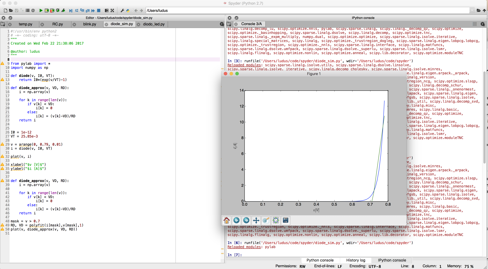
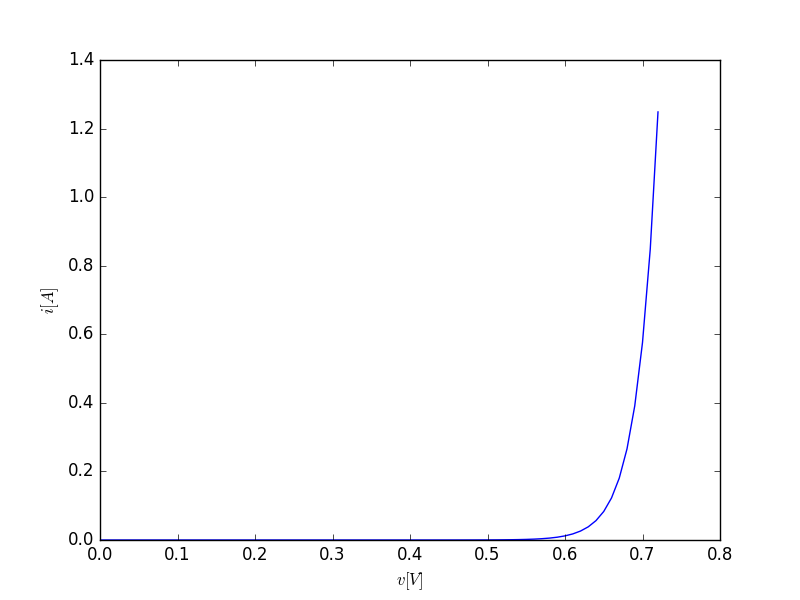
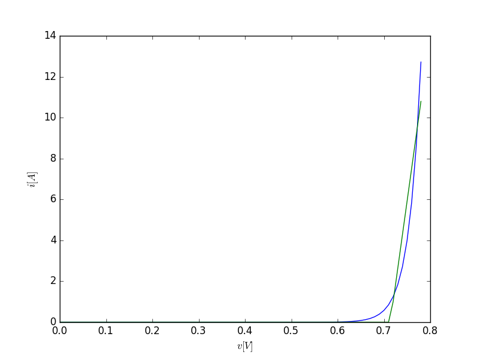

Prendo ispirazione da [questo post](http://www.lafucinadellescienze.it/wordpress/archives/3878) pubblicato dal prof. Alfonso d'Ambrosio per sviluppare il prossimo esperimento di fisica basato su Python e Arduino.



In questo esperimento, misureremo la curva tensione corrente di alcuni diodi led colorati, verificandone l'andamento esponezione. In seguito, useremo i dati raccolti per misurare sperimentalmente il valore di una delle costanti fondamentali dalla fisica: la [**costante di Planck**](https://it.wikipedia.org/wiki/Costante_di_Planck) $h$.

Per ulteriori informazioni su come utilizzare e installare **Spyder** e la libreria **nanpy** per il controllo seriale di Arduino, rimando al mio [precedente post](http://www.ludusrusso.cc/posts/2017-02-19-python-arduino-nanpy).

## Diodo LED

Un Diodo LED è uno dei componenti più utilizzati in elettronica, ed è uno dei primi componenti elettronici che si affrontano quando si iniziano a fare i primi esperimenti in elettronica. Essenzialmente, un Led è un componente elettronico che emette radiazioni luminose di un colore noto quando alimentato.

### Teoria e simulazione di un Diodo

Da un punto di vista elettronico, il Led è un Diodo: una resistenza non lineare il cui andamento corrente-tensione (ideale) è logaritmico e può essere descritto dalla seguente equazione

$$
i = I_0\left(e^{\frac{v}{nV_T}} - 1 \right)
$$

Dove $i$ e $v$ sono, rispettivamente, corrente che attraversa il diodo e tensione ai suoi capi, mentre $I_0$ (corrente di saturazione) e $V_T$ (tensione termica) sono parametri che caratterizzano il diodo stesso.

Utilizzando i valori tipici per queste due costanti ( $I_0 = 10^{-12}A$ e $V_T = 25.85mV$ ), è possibile simulare un classico diodo di silicio in Python e Spyder. Lo script utilizzato è il seguente

```python
from pylab import *

def diode(v, I0, VT):
    return I0*(exp(v/VT)-1)

I0 = 1e-12
VT = 25.85e-3

v = arange(0, 0.73, 0.01)
plot(v, diode(v, I0, VT))

xlabel("$v [V]$")
ylabel("$i [A]$")
```

Che produce, come risultato



In prima approssimazione, la curva logaritmica di un diodo può essere approssimata con una funzione spezzata descritta come segue

$$
i^* =
\begin{cases}
	0 & \text{se $v < V_D$} \\
	\frac{1}{R_D}(v-V_D) & \text{se $v > V_D$}
\end{cases}
$$

dove $V_D$ è detta tensione di attivazione, ed è una costante empirica che rappresenta la minima tensione a partire dalla quale il diodo inizia a condurre. $R_D$ approssima la resistenza interna al diodo.

Per approssimare una curva logartimica, si può procedere in vari modi. Io suggerisco di utilizzare la funzione `polyfit` (che approssima una serie di punti con un polinomio) considerando solo i punti dei grafico in cui la curva inizia effettivamente a crescere. La selezione di questi punti viene fatta manualmente, ad esempio, selezionando tutti i punti per cui $v>0.7$, come nello script qui riportato

```python
mask = v > 0.7
RD, VD = polyfit(i[mask],v[mask],1)
```

Per plottare questi dati, dobbiamo prima di tutto implementare una funzione che genera $i^*$ a partire da $v$:

```python
import numpy as np

def diode_approx(v, VD, RD):
    i = np.array(v)

    for k in range(len(v)):
        if v[k] < VD:
            i[k] = 0
        else:
            i[k] = (v[k]-VD)/RD
    return i
```

e a questo punto, possiamo plottare insieme i due grafici, ottenendo quanto riportato in figura



### Teoria sul LED

Capiti i diodi, possiamo finalmente parlare di LED. Essenzialmente un diodo Led è un Diodo che emette fotoni (luce) di un particolare colore se polarizzato. La caratteristica dei diodi LED è che la tensione $V_D$ dipende dalla frequenza luminosa emessa, ed è esprimibile in questo modo:

$$
V_D \simeq \frac{h\gamma}{e}
$$

Dove $\gamma$ è la frequenza della radiazione emessa, $h$ è la costante di Planck e $e$ è la carica elettrica dell'elettrone (in valore assoluto).

È quindi facile capire che, conoscendo la carica elettrica dell'elettrone, è possibile ottenere una stima della costante di Planck misurando la tensione $V_D$ di led di diverso colore.

## Conclusione prima parte

Per adesso mi fermo qui, per non far diventare questo tutorial troppo lungo! Nel prossimo tutorial, vedremo come utilizzare la teoria presentata oggi per caratterizzare sperimentalmente un led con Arduino e Python e misurare la costante di Planck in modo sperimentale.

Sotto trovate il codice completo utilizzato in questo tutorial.

```python
from pylab import *
import numpy as np

def diode(v, I0, VT):
    return I0*(exp(v/VT)-1)

def diode_approx(v, VD, RD):
    i = np.array(v)

    for k in range(len(v)):
        if v[k] < VD:
            i[k] = 0
        else:
            i[k] = (v[k]-VD)/RD
    return i


I0 = 1e-12
VT = 25.85e-3

v = arange(0, 0.79, 0.01)
i = diode(v, I0, VT)

plot(v, i)

xlabel("$v [V]$")
ylabel("$i [A]$")


def diode_approx(v, VD, RD):
    i = np.array(v)

    for k in range(len(v)):
        if v[k] < VD:
            i[k] = 0
        else:
            i[k] = (v[k]-VD)/RD
    return i

mask = v > 0.7
RD, VD = polyfit(i[mask],v[mask],1)
plot(v, diode_approx(v, VD, RD))
```
