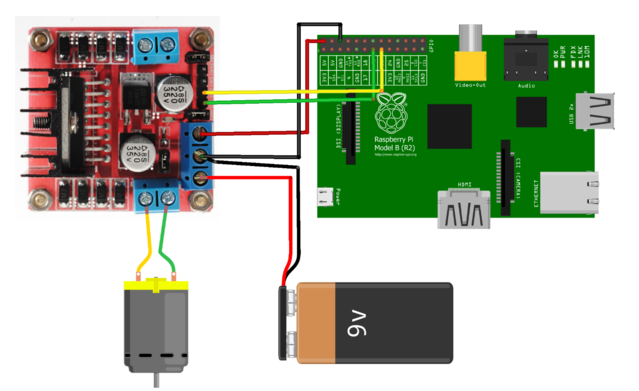
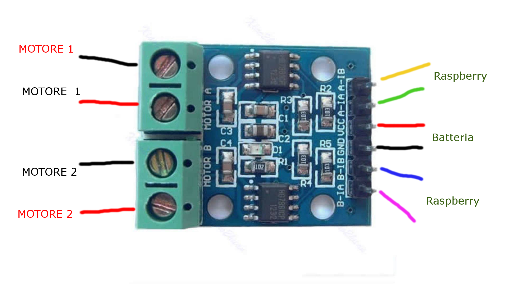

La scheda L298N si configura così (ovviamente i GPIO per il PWM vanno configurati via codice)!

Invece la HG7881 così

Oppure consigliamo anche la scheda motori in questo fantastico kit [CAM JAM](https://thepihut.com/collections/camjam-edukit/products/camjam-edukit-3-robotics)

