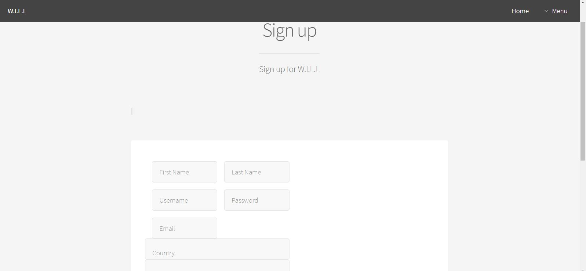
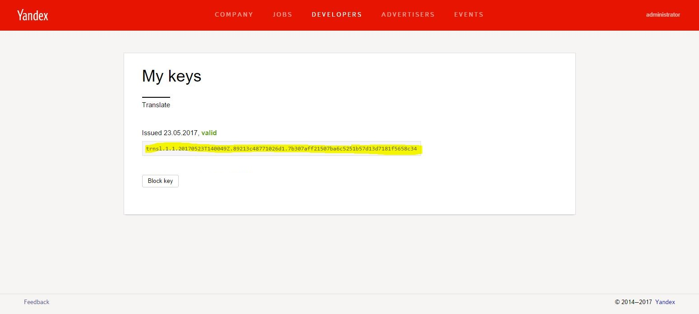
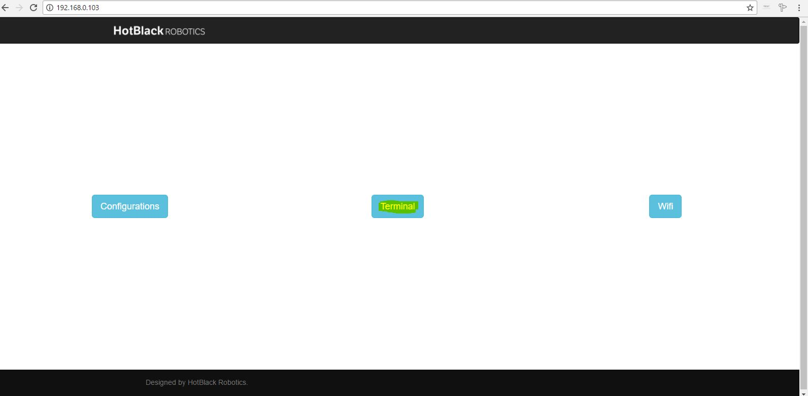
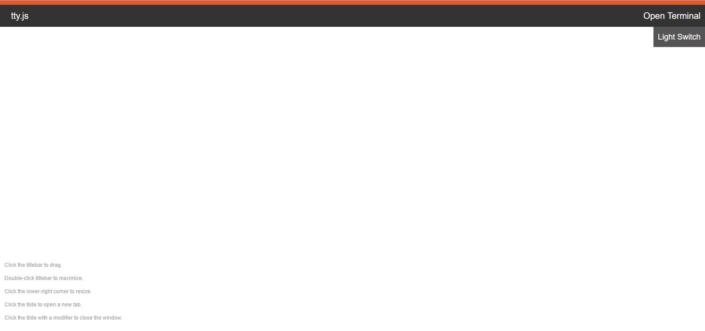
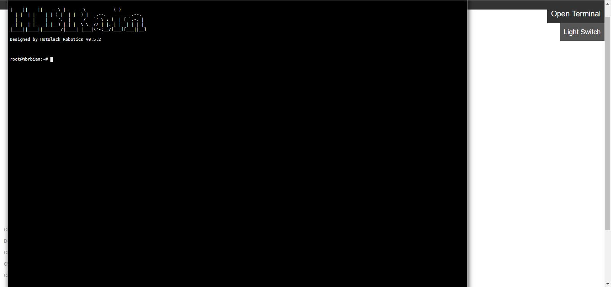
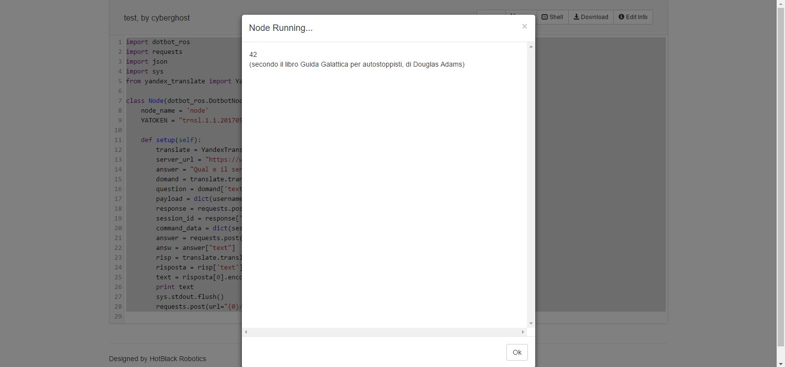
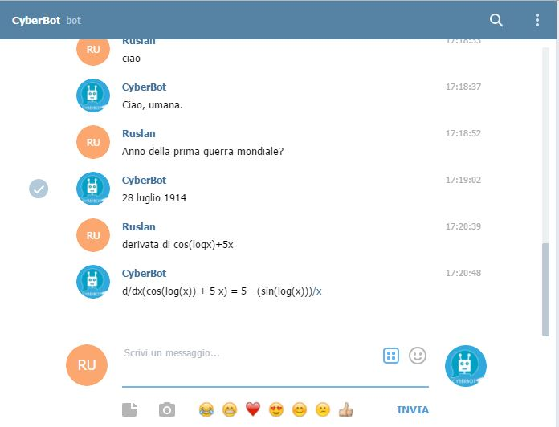
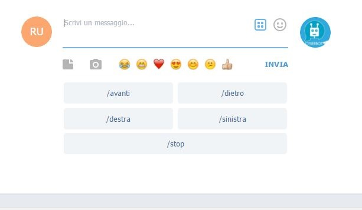

**In questo tutorial vedremo come implementare l'intelligenza artificiale sul proprio dotbot.**
Navigando su internet ho trovato un servizio che mette insieme diverse API tra cui wikipedia, wolframalpha e google assistant. Si tratta del sito [https://willbeddow.com](https://willbeddow.com/) il quale unisce tutti questi servizi, e ne crea uno completamente gratuito ed ovviamente senza limiti di richieste.
Come primo passo dobbiamo registrarci [qui](https://willbeddow.com/signup)

Una volta registrati possiamo iniziare a scrivere il codice:

    import dotbot_ros
    import requests
    import json
    import sys

    class Node(dotbot_ros.DotbotNode):
        node_name = 'node'

        def setup(self):
            server_url = "https://willbeddow.com"
            payload = dict(username="USER", password="PASS")
            response = requests.post(url="{0}/api/start_session".format(server_url), data=payload).json()
            session_id = response["data"]["session_id"]
            command_data = dict(session_id=session_id, command="What is the meaning of life?")
            answer = requests.post(url="{0}/api/command".format(server_url), data=command_data).json()
            print answer["text"]
            sys.stdout.flush()
            requests.post(url="{0}/api/end_session".format(server_url), data={"session_id": session_id})

_IMPORTANTE: ricordate di modificare il campo username e password inserendoli tra i doppi apici._

**Analizziamo il codice**
Come al solito, il nostro programma è composto da un nodo ROS, la funzione principale è la funzione setup, che si occupa di inizializzare il bot .

    server_url = "https://willbeddow.com"
    payload = dict(username="USER", password="PASS")

Server url è il link dove vengono inviate le richieste di tipo POST.
Username e Password sono i dati necessari per l'autorizzazione.

    response = requests.post(url="{0}/api/start_session".format(server_url), data=payload).json()
    session_id = response["data"]["session_id"]

Inizio di una nuova sessione e creazione del session token.

       command_data = dict(session_id=session_id, command="What is the meaning of life?")
       answer = requests.post(url="{0}/api/command".format(server_url), data=command_data).json()

Chiamata del metodo POST , il quale invia la domanda e riceve la risposta in formato json.

    requests.post(url="{0}/api/end_session".format(server_url), data={"session_id": session_id})

Fine della sessione e disabilitazione del token session.

Una volta implementato il programma, lanciamo il codice!

Come vedete il bot ha risposto alla domanda "What is the meaning of life?".

A questo punto, se il bot ha risposto correttamente, implementiamo la lingua italiana attraverso [Yandex.Translate.](https://tech.yandex.com/translate/)

Per sviluppare questo progetto ho scelto di usare il traduttore di Yandex e non quello di Google.
_Non c'è nessuna differenza tra i due, per quanto riguarda la traduzione, entrambi i traduttori utilizzato lo stesso sistema di traduzione automatica._

Una volta registrati , otteniamo la nostra API.

Dopo aver ottenuto la nostra API , installiamo la libreria **yandex_translate** sul nostro RaspBerry.
Per installarla, basta andare sull'IP del bot e successivamente fare click su Terminal.

Una volta entrati , la piattaforma chiede i permessi per accedere su quella pagina.

Il nome utente è "hbrain" , e la password è "dotbot".

Adesso apriamo il terminale, facendo click su **Open Terminal**

A questo punto possiamo installare la libreria necessaria.

Per installarla dobbiamo usare il comando **apt-get install _"nome libreria"_** , nel nostro caso è apt-get install yandex_translate.

Possiamo iniziare finalmente a programmare :)

Implementiamo il traduttore nel nostro programma:

    import dotbot_ros
    import requests
    import json
    import sys
    from yandex_translate import YandexTranslate

    class Node(dotbot_ros.DotbotNode):
        node_name = 'node'
        YATOKEN = "trnsl.1.1.20170523T140049Z.89213c48771026d1.7b307aff21507ba6c5251b57d13d7181f5658c34"

        def setup(self):
            translate = YandexTranslate(self.YATOKEN)
            server_url = "https://willbeddow.com"
            answer = "Qual e il senso della vita?"
            domand = translate.translate(answer.encode('utf-8'), 'it-en')
            question = domand['text']
            payload = dict(username="USER", password="PASS")
            response = requests.post(url="{0}/api/start_session".format(server_url), data=payload).json()
            session_id = response["data"]["session_id"]
            command_data = dict(session_id=session_id, command=question)
            answer = requests.post(url="{0}/api/command".format(server_url), data=command_data).json()
            answ = answer["text"]
            risp = translate.translate(answ, 'en-it')
            risposta = risp['text']
            text = risposta[0].encode('utf-8')
            print text
            sys.stdout.flush()
            requests.post(url="{0}/api/end_session".format(server_url), data={"session_id": session_id})

Come avete visto ci sono servite solo qualche righe di codice per tradurre la domanda dall'italiano in inglese.

    YATOKEN = "IL TUO YANDEX TOKEN"

Nella funzione setup il token viene chiamato da:

       translate = YandexTranslate(self.YATOKEN)

La variabile "domand" riceve un messaggio (tradotto dall'italiano in inglese) in formato Json e viene transformato in una stringa.

    domand = translate.translate(answer.encode('utf-8'), 'it-en')
    question = domand['text']

La stessa cosa è uguale per la risposta:

    risp = translate.translate(answ, 'en-it')
    risposta = risp['text']

La risposta viene tradotta dal inglese in italiano e viene trasformata in una stringa.

Una volta eseguito il codice abbiamo in output questa finestra:

**Ora trasformiamo questo programma in una ChatBot (Telegram).**
Per farlo basta creare un bot seguendo questa [guida](http://hotblackrobotics.github.io/blog/posts/2017-02-16-tutorial-sviluppiamo-un-bot-telegram-in-ros).
A questo punto, ottenuto il Token , implementiamolo nel nostro codice.

    import dotbot_ros
    import telepot
    import sys
    from yandex_translate import YandexTranslate
    import requests
    import json

    class Node(dotbot_ros.DotbotNode):
        node_name = 'bot'
        TOKEN = "INSERISCI QUI IL TUO TOKEN TELEGRAM"
        YATOKEN = "trnsl.1.1.20170523T140049Z.89213c48771026d1.7b307aff21507ba6c5251b57d13d7181f5658c34"

        def setup(self):
            self.bot = telepot.Bot(self.TOKEN)
            self.bot.message_loop(self.handle)
            self.server_url = "https://willbeddow.com"
            self.payload = dict(username="USER", password="PASS")
            self.translate = YandexTranslate(self.YATOKEN)

        def handle(self, msg):
            content_type, chat_type, chat_id = telepot.glance(msg)
            nome = msg['from']['first_name']
            domanda = msg['text']
            domand = self.translate.translate(domanda.encode('utf-8'), 'it-en') #traduzione da italiano in inglese
            question = domand['text']  #decodifico le api
            response = requests.post(url="{0}/api/start_session".format(self.server_url), data=self.payload).json()  #viene creata una nuova sessione
            session_id = response["data"]["session_id"] #viene creata la session id
            command_data = dict(session_id=session_id, command=question)
            answer = requests.post(url="{0}/api/command".format(self.server_url), data=command_data).json()
            answ = answer["text"]
            risp = self.translate.translate(answ, 'en-it')
            risposta = risp['text']
            text = risposta[0].encode('utf-8') #decode da unicode in utf8
            requests.post(url="{0}/api/end_session".format(self.server_url), data={"session_id": session_id}) #la sessione viene chiusa
            self.bot.sendMessage(chat_id, text) #viene inviata la risposta
            print msg
            sys.stdout.flush()

**Analizziamo il codice:**

    self.bot = telepot.Bot(self.TOKEN)

Crea il bot utilizzando il token inizializzato

    self.bot.message_loop(self.handle)

Ogni volta che il bot riceve un messaggio , viene chiamata la funzione handle

Alla funzione _handle_ viene passato il parametro msg.

    def handle(self, msg):
            content_type, chat_type, chat_id = telepot.glance(msg)
            nome = msg['from']['first_name']
            domanda = msg['text']
            domand = self.translate.translate(domanda.encode('utf-8'), 'it-en') #traduzione da italiano in inglese
            question = domand['text']  #decodifico le api
            response = requests.post(url="{0}/api/start_session".format(self.server_url), data=self.payload).json()  #viene creata una nuova sessione
            session_id = response["data"]["session_id"] #viene creata la session id
            command_data = dict(session_id=session_id, command=question)
            answer = requests.post(url="{0}/api/command".format(self.server_url), data=command_data).json()
            answ = answer["text"]
            risp = self.translate.translate(answ, 'en-it')
            risposta = risp['text']
            text = risposta[0].encode('utf-8') #decode da unicode in utf8
            requests.post(url="{0}/api/end_session".format(self.server_url), data={"session_id": session_id}) #la sessione viene chiusa
            self.bot.sendMessage(chat_id, text) #viene inviata la risposta
            print msg
            sys.stdout.flush()

     content_type, chat_type, chat_id = telepot.glance(msg)

Questa riga si occupa di estrarre il chat_id che si occupa di gestire più chat contemporaneamente e content_type: il tipo di dati contenuti nell'messaggio.

    nome = msg['from']['first_name']
    domanda = msg['text']

Estraiamo il nome dell'utente che sta scrivendo al bot e la sua domanda.

Una volta generata la risposta , viene inviata all'utente:

    self.bot.sendMessage(chat_id, text)

Lanciamo il codice completo e vediamo il suo funzionamento:

Ma se volessimo farlo pure muovere da telegram?
Il nuovo codice implementato è il seguete:

    import dotbot_ros
    import telepot
    from gpiozero import Robot
    import sys
    from yandex_translate import YandexTranslate
    import requests
    import json
    import time
    from telepot.namedtuple import ReplyKeyboardMarkup, KeyboardButton

    class Node(dotbot_ros.DotbotNode):
        node_name = 'bot'
        TOKEN = "INSERISCI QUI IL TUO TOKEN TELEGRAM"
        YATOKEN = "trnsl.1.1.20170523T140049Z.89213c48771026d1.7b307aff21507ba6c5251b57d13d7181f5658c34"

        def setup(self):
            self.bot = telepot.Bot(self.TOKEN)
            self.bot.message_loop(self.handle)
            self.server_url = "https://willbeddow.com"
            self.payload = dict(username="USER", password="PASS")
            self.translate = YandexTranslate(self.YATOKEN)
            self.robot = Robot(left=(9,10), right=(7,8))

        def handle(self, msg):
            content_type, chat_type, chat_id = telepot.glance(msg)
            nome = msg['from']['first_name']
            domanda = msg['text']
            if domanda[0] == '/':
                self.bot.sendMessage(chat_id, 'scegli una delle voci', reply_markup=ReplyKeyboardMarkup(
                            keyboard=[
                                [KeyboardButton(text="/avanti"), KeyboardButton(text="/dietro")],
                                [KeyboardButton(text="/destra"), KeyboardButton(text="/sinistra")],
                                [KeyboardButton(text="/stop")]
                            ]
                        ))
                if domanda == '/start':
                    self.bot.sendMessage(chat_id, "ciao, " + nome + " benvenuto nella mia chat!")
                elif domanda == '/avanti':
                    self.bot.sendMessage(chat_id, "ok, vado avanti")
                    self.robot.forward()
                    time.sleep(0.25)
                    self.robot.stop()
                elif domanda == '/dietro':
                    self.bot.sendMessage(chat_id, "ok, vado dietro")
                    self.robot.backward()
                    time.sleep(0.25)
                    self.robot.stop()
                elif domanda == '/destra':
                    self.bot.sendMessage(chat_id, "ok, giro a destra")
                    self.robot.right()
                    time.sleep(0.2)
                    self.robot.stop()
                elif domanda == '/sinistra':
                    self.bot.sendMessage(chat_id, "ok, giro a sinistra")
                    self.robot.left()
                    time.sleep(0.2)
                    self.robot.stop()
                elif domanda == '/stop':
                    self.robot.stop()
                else:
                    self.bot.sendMessage(chat_id, "scusa, non capisco questo comando")

            else:
                domand = self.translate.translate(domanda.encode('utf-8'), 'it-en') #traduzione da italiano in inglese
                question = domand['text']  #decodifico le api
                response = requests.post(url="{0}/api/start_session".format(self.server_url), data=self.payload).json()  #viene creata una nuova sessione
                session_id = response["data"]["session_id"] #viene creata la session id
                command_data = dict(session_id=session_id, command=question)
                answer = requests.post(url="{0}/api/command".format(self.server_url), data=command_data).json()
                answ = answer["text"]
                risp = self.translate.translate(answ, 'en-it')
                risposta = risp['text']
                text = risposta[0].encode('utf-8') #decode da unicode in utf8
                requests.post(url="{0}/api/end_session".format(self.server_url), data={"session_id": session_id}) #la sessione viene chiusa
                self.bot.sendMessage(chat_id, text) #viene inviata la risposta

            print msg
            sys.stdout.flush()

**Analizziamo il codice**

Nella funzione setup abbiamo:

    self.robot = Robot(left=(9,10), right=(7,8))

Qui si crea un oggetto Robot, il quale permette di gestire i motori e quindi farli muovere.
IMPORTANTE: ricordate di modificare i campi "(left=(9,10), right=(7,8))" con i vostri PIN dei motori.

    self.bot.sendMessage(chat_id, 'scegli una delle voci', reply_markup=ReplyKeyboardMarkup(
                            keyboard=[
                                [KeyboardButton(text="/avanti"), KeyboardButton(text="/dietro")],
                                [KeyboardButton(text="/destra"), KeyboardButton(text="/sinistra")],
                                [KeyboardButton(text="/stop")]
                            ]
                        ))

Si occupa di dare i suggerimenti all'utente dei comandi disponibili.

    elif domanda == '/avanti':
                    self.bot.sendMessage(chat_id, "ok, vado avanti")
                    self.robot.forward()
                    time.sleep(0.25)
                    self.robot.stop()
                elif domanda == '/dietro':
                    self.bot.sendMessage(chat_id, "ok, vado dietro")
                    self.robot.backward()
                    time.sleep(0.25)
                    self.robot.stop()
                elif domanda == '/destra':
                    self.bot.sendMessage(chat_id, "ok, giro a destra")
                    self.robot.right()
                    time.sleep(0.2)
                    self.robot.stop()
                elif domanda == '/sinistra':
                    self.bot.sendMessage(chat_id, "ok, giro a sinistra")
                    self.robot.left()
                    time.sleep(0.2)
                    self.robot.stop()
                elif domanda == '/stop':
                    self.robot.stop()
                else:
                    self.bot.sendMessage(chat_id, "scusa, non capisco questo comando")

Questa parte permette di muovere il bot nelle 4 direzioni.

    time.sleep(0.25)
    Gestisce il tempo dell'esecuzione del comando.

Se avete la **picam** e volete fare pure le foto attraverso il Raspberry , allora implementate questo piccolo codice:

    elif domanda == '/image':
    img_str = cv2.imencode('.jpg', self.img)[1].tostring()
    self.bot.sendPhoto(chat_id('image.jpg',StringIO.StringIO(img_str)))

Vediamo a questo punto il codice finale:

    import dotbot_ros
    import telepot
    from gpiozero import Robot
    import sys
    import cv2
    import time
    from std_msgs.msg import String
    from sensor_msgs.msg import Image
    from cv_bridge import CvBridge, CvBridgeError
    import StringIO
    from mtranslate import translate
    from yandex_translate import YandexTranslate
    import requests
    import json
    from telepot.namedtuple import ReplyKeyboardMarkup, KeyboardButton

    class Node(dotbot_ros.DotbotNode):
        node_name = 'bot'
        TOKEN = "INSERISCI QUI IL TUO TOKEN TELEGRAM"
        YATOKEN = "trnsl.1.1.20170523T140049Z.89213c48771026d1.7b307aff21507ba6c5251b57d13d7181f5658c34"

        def setup(self):
            self.bot = telepot.Bot(self.TOKEN)
            self.bot.message_loop(self.handle)
            self.image_sub = dotbot_ros.Subscriber("/camera/image",Image,self.callback)
            self.img = None
            self.bridge = CvBridge()
            self.shape = None
            self.image = None
            self.server_url = "https://willbeddow.com"
            self.payload = dict(username="USER", password="PASS")
            self.translate = YandexTranslate(self.YATOKEN)
            self.robot = Robot(left=(9,10), right=(7,8))

        def callback(self,data):
            self.img = self.bridge.imgmsg_to_cv2(data, "bgr8")

        def handle(self, msg):
            content_type, chat_type, chat_id = telepot.glance(msg)
            nome = msg['from']['first_name']
            domanda = msg['text']
            if domanda[0] == '/':
                self.bot.sendMessage(chat_id, 'scegli una delle voci', reply_markup=ReplyKeyboardMarkup(
                            keyboard=[
                                [KeyboardButton(text="/avanti"), KeyboardButton(text="/dietro")],
                                [KeyboardButton(text="/destra"), KeyboardButton(text="/sinistra")],
                                [KeyboardButton(text="/image")],[KeyboardButton(text="/stop")]
                            ]
                        ))
                if domanda == '/start':
                    self.bot.sendMessage(chat_id, "ciao, " + nome + " benvenuto nella mia chat!")
                elif domanda == '/image':
                    img_str = cv2.imencode('.jpg', self.img)[1].tostring()
                    self.bot.sendPhoto(chat_id,('image.jpg', StringIO.StringIO(img_str)))
                elif domanda == '/avanti':
                    self.bot.sendMessage(chat_id, "ok, vado avanti")
                    self.robot.forward()
                    time.sleep(0.25)
                    self.robot.stop()
                elif domanda == '/dietro':
                    self.bot.sendMessage(chat_id, "ok, vado dietro")
                    self.robot.backward()
                    time.sleep(0.25)
                    self.robot.stop()
                elif domanda == '/destra':
                    self.bot.sendMessage(chat_id, "ok, giro a destra")
                    self.robot.right()
                    time.sleep(0.2)
                    self.robot.stop()
                elif domanda == '/sinistra':
                    self.bot.sendMessage(chat_id, "ok, giro a sinistra")
                    self.robot.left()
                    time.sleep(0.2)
                    self.robot.stop()
                elif domanda == '/stop':
                    self.robot.stop()
                else:
                    self.bot.sendMessage(chat_id, "scusa, non capisco questo comando")

            else:
                domand = self.translate.translate(domanda.encode('utf-8'), 'it-en') #traduzione da italiano in inglese
                question = domand['text']  #decodifico le api
                response = requests.post(url="{0}/api/start_session".format(self.server_url), data=self.payload).json()  #viene creata una nuova sessione
                session_id = response["data"]["session_id"] #viene creata la session id
                command_data = dict(session_id=session_id, command=question)
                answer = requests.post(url="{0}/api/command".format(self.server_url), data=command_data).json()
                answ = answer["text"]
                risp = self.translate.translate(answ, 'en-it')
                risposta = risp['text']
                text = risposta[0].encode('utf-8') #decode da unicode in utf8
                requests.post(url="{0}/api/end_session".format(self.server_url), data={"session_id": session_id}) #la sessione viene chiusa
                self.bot.sendMessage(chat_id, text) #viene inviata la risposta

            print msg
            sys.stdout.flush()

_Adesso il nostro bot riesce a rispondere a qualsiasi domanda, muoversi e infine fare foto._

